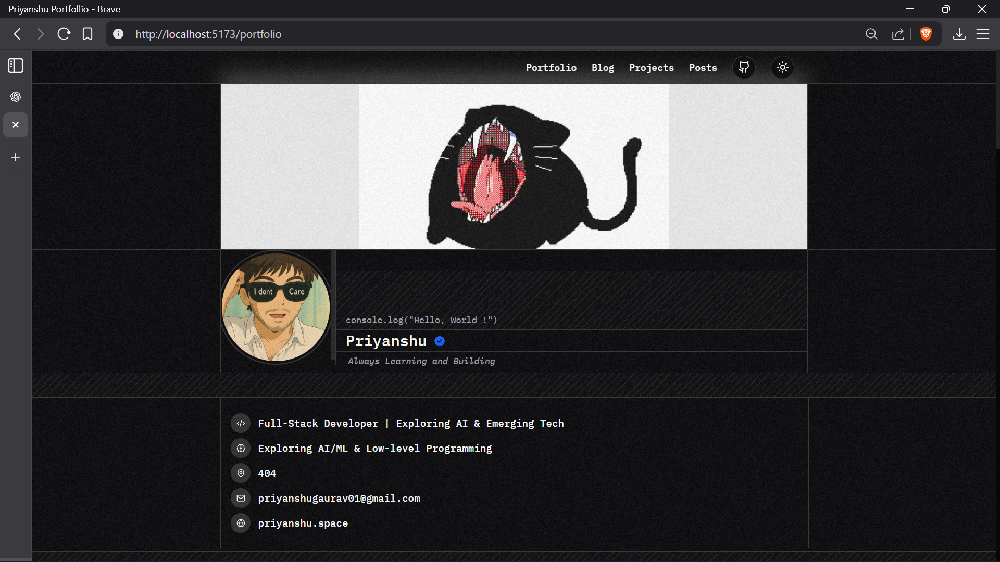
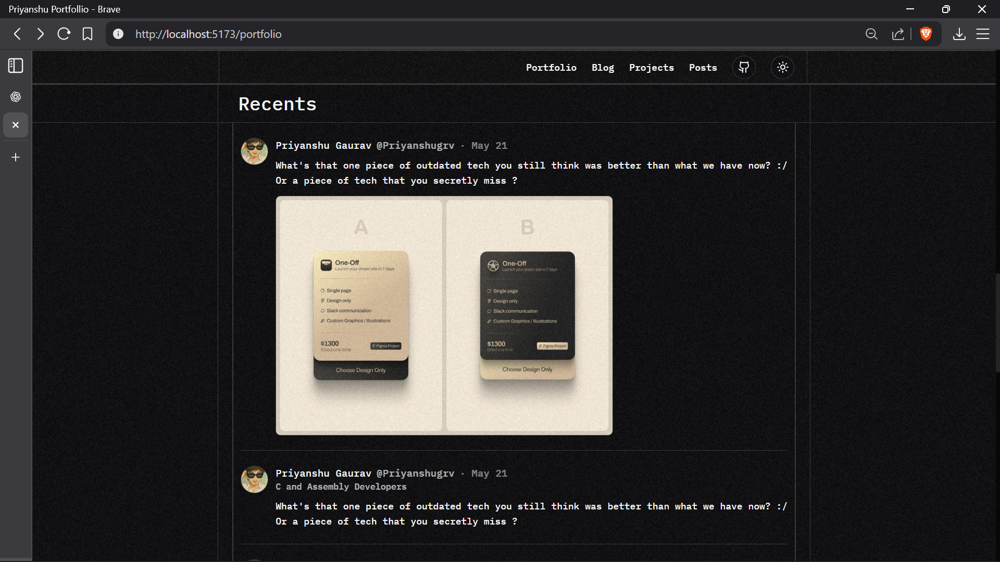

# 🌐 Priyanshu Gaurav – Portfolio

This is my personal portfolio website built with **React + Vite + Tailwind CSS** and deployed on **GitHub Pages**.  
It showcases my projects, blogs, and experiments in building cool stuff.

---

## ✨ Features
- ⚡ **Fast & Modern** – Built with Vite for blazing speed.
- 🎨 **TailwindCSS Styling** – Clean, responsive, and mobile-friendly.
- 📂 **Projects Showcase** – Highlighting my best work with image galleries.
- 📝 **Blog Section** – Sharing my learnings, experiments, and ideas.
- 🔗 **Live Deployment** – Hosted on GitHub Pages at:
  👉 [https://priyanshugrv.github.io/portfolio](https://priyanshugrv.github.io/portfolio)

---

## 🛠️ Tech Stack
- [React](https://react.dev/) – UI library  
- [Vite](https://vitejs.dev/) – Next-gen frontend tooling  
- [Tailwind CSS](https://tailwindcss.com/) – Utility-first styling  
- [Lucide Icons](https://lucide.dev/) – Icons  
- [GitHub Pages](https://pages.github.com/) – Hosting  

---

## 📸 Screenshots
### Homepage  


### Project Details  


---

## 🚀 Setup & Run Locally

1. **Clone the repository**
   ```bash
   git clone https://github.com/priyanshugrv/portfolio.git
   cd portfolio
